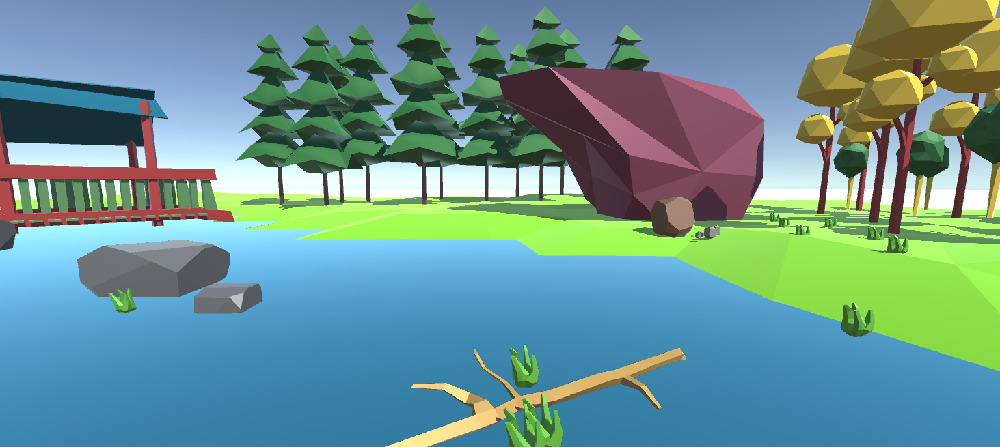

# Island - Low Poly Asset Library

A low polygon library of assets in Unity for a game that takes place on an island. Currently still work in progress but the intention is to use
the resulting assets to make a game. 